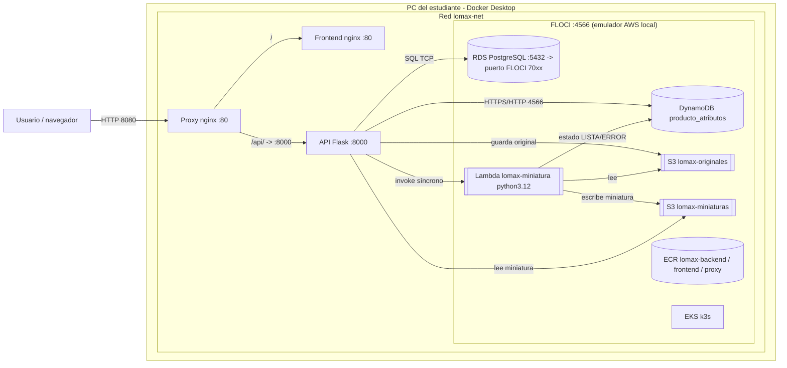

# Etapa 1 – Diseño de la arquitectura (P2)

**Debe entregar un diagrama con íconos oficiales de AWS.** Herramienta: https://app.diagrams.net → *Más formas* → activar **AWS 19** (o AWS Architecture 2021). Guarde `arquitectura.drawio` y exporte PNG a `evidencias/E1`.

## Esquema base (dibújelo con íconos AWS)

## Qué debe señalar expresamente en el diagrama
- **Entorno local FLOCI** (recuadro, puerto 4566, en Docker Desktop).
- **Frontend** (nginx :80), **Proxy** (nginx :80, publicado en **8080**; `/` → frontend, `/api/` → API), **API** (Flask/gunicorn :8000).
- **Redes:** `lomax-net` (Docker) y, en EKS, red de pods/Services (ClusterIP: backend 8000, frontend 80; NodePort 30080 del proxy).
- **Protocolos/puertos:** HTTP 8080 (usuario→proxy), HTTP 4566 (API→servicios AWS), TCP PostgreSQL (API→RDS), invocación síncrona Lambda.
- **Almacenamiento:** RDS (relacional, volumen del contenedor postgres), DynamoDB (estado persistente de FLOCI, volumen `floci-data`), S3 (2 buckets).
- **Ubicación en Kubernetes:** namespace `lomax` con Deployments `proxy`, `frontend`, `backend` (1→3 réplicas) y sus Services; RDS/DynamoDB/S3/Lambda quedan **fuera** de los pods (persistencia externa). Imágenes desde **ECR**.

## Flujo de un producto
1. `POST /productos` → RDS `PENDIENTE` + atributos en DynamoDB.
2. `POST /productos/{id}/imagen` → original a S3 → **Lambda síncrona** → miniatura ≤300×300 en S3 + estado LISTA/ERROR en DynamoDB.
3. Solo si hay atributos **y** miniatura verificada → RDS `PUBLICADO`. Si algo falla queda `PENDIENTE` y se reintenta con `/reprocesar` (clave determinista `miniaturas/{id}.jpg`, no duplica).
4. El catálogo combina RDS + DynamoDB y sirve la miniatura desde S3 por la API.

**Verificación E1:** al terminar, contraste el diagrama con `docker ps`, `.\aws.ps1 s3 ls`, `.\aws.ps1 dynamodb list-tables`, `.\aws.ps1 rds describe-db-instances`, `.\aws.ps1 lambda list-functions`, `.\aws.ps1 ecr describe-repositories`, `.\aws.ps1 eks list-clusters`, `.\kubectl.ps1 -n lomax get all`.
